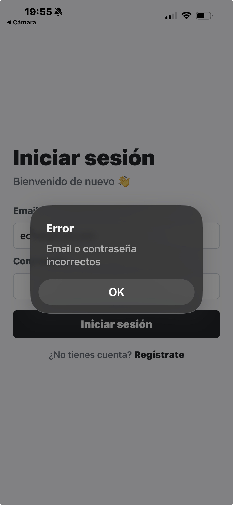

# Ejercicio 2 - Pantalla de inicio de sesión

## Implementación

La pantalla de login se encuentra en `app/login.tsx` y permite iniciar sesión con una cuenta existente.

### Campos del formulario

- **Email**: campo con teclado de tipo email
- **Contraseña**: campo oculto con `secureTextEntry`

### Validaciones implementadas

- El email debe tener un formato válido
- La contraseña no puede estar vacía

### Llamada a la API

Si los datos son válidos se llama al endpoint `POST /auth/login`:

```typescript
const response = await login({ email, pswd: password });
await saveToken(response.object.token);
router.replace("/welcome");
```

### Almacenamiento del token

El token JWT devuelto por la API se almacena en el dispositivo usando `AsyncStorage` a través del servicio `storage.service.ts`:

```typescript
export async function saveToken(token: string): Promise<void> {
  await AsyncStorage.setItem(TOKEN_KEY, token);
}
```

### Respuestas de la API controladas

| Código | Descripción | Acción |
|--------|-------------|--------|
| 200 | Login exitoso | Guarda token y redirige a bienvenida |
| 400 | Cuerpo inválido | Alerta de error |
| 401 | Credenciales incorrectas | Alerta de error |

### Enlace a registro

La pantalla incluye un enlace para navegar a la pantalla de registro para usuarios no registrados.

### Capturas

#### Pantalla de login vacía


#### Login fallido


#### Login exitoso
